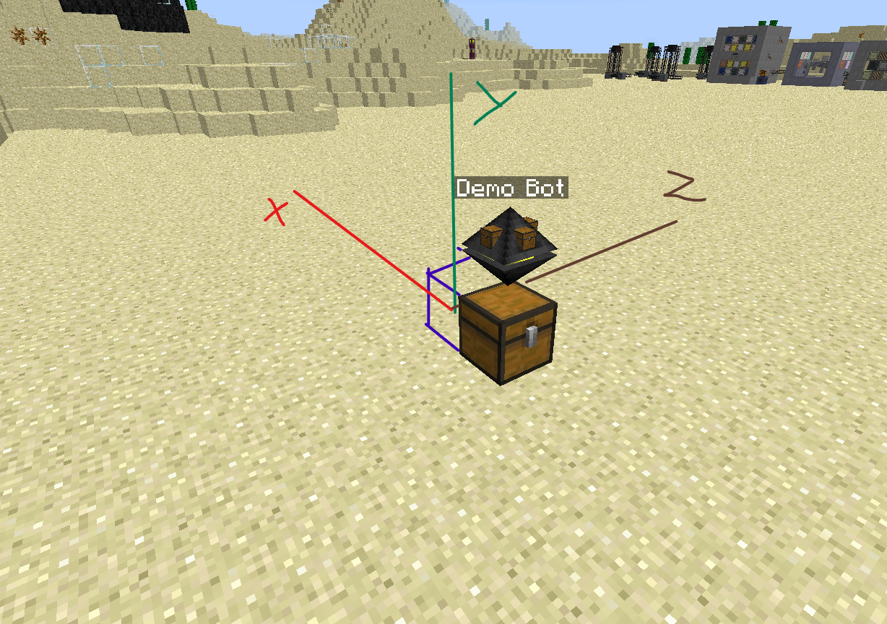

# NuclearCraft Overhaul Reactor Builder

Run 
`wget -f https://raw.githubusercontent.com/sanrom/nco-reactor-builder/master/rb_installer.lua` 
`rb_installer.lua` 
in OpenComputers to install the scripts!

## Features

- [x] Fission SFRs
- [x] Fission MSRs
- [x] Turbines
- [ ] ~~Heat Exchangers~~
- [ ] ~~Fusion Reactors~~
- [x] NCPF Files (Thiz Reactor Planner)
- [ ] JSON Files (Hellrage Reactor Planner)
- [ ] Casing for Reactors
- [x] Casing for Turbines
- [ ] Automatic cell filtering
- [x] Direct download from Google Drive, Dropbox
- [x] Support for addons
- [ ] QMD Added blocks

## Requirements

Both scirpts are made to run on **Lua 5.3**, and running them on any other version may cause errors or unexpected behavoir. Please make sure that you are running the correct version of Lua before reporting bugs

For the config2 parser, there are no hard requirements, except a lot of ram to load big files

For the reactor builder, a robot with the following components/upgrades are **required**:
- Inventory Controller Upgrade
- At least one Inventory Upgrade
- Angel Upgrade
- Hover Upgrade (Tier 1)
- Screen
- Graphics Card
- Keyboard
- Internet Card (to download the scripts)

The following componets/upgrades are *recommended*:
- Multiple Inventory Upgrades: more inventory space on the robot means less back and forth to the storage chest
- Good amount of RAM, especially for larger reactors
- Chunkloader Upgrade: to let the robot build while you are not around

## Setup

In the image above, the blue block represents where the first corner block will be placed. The robot will then proceed to build out the reactor in the three axes listed. The robot requires an extra layer of space at the top of the reactor to place the final layer of blocks. The column above the initial inventory also needs to be clear of any obstructions.

To function properly, the robot will need access to an inventory below its starting position. You can insert extra blocks into this inventory for the robot to pick them up as it needs. If the robot runs out of blocks in it's internal inventory while it is building, it will check that inventory for blocks.

If you want to see the outline of the reactor before building it, run `reactor_builder -o <filename>`. The robot will move along the x, y, and z axes respectively to show the *internal* size of the reactor.

If your reactor uses multiple fuel types, run with the `-l` flag. This will stop the robot at each level, allowing you to filter the fuel cells before the robot builds over it.

## Examples

### Overhaul Tutorial SFR

[Link to NCPF File](examples/OverhaulTutorialSFR.ncpf)

Download the NCPF file to the robot: `wget -f https://raw.githubusercontent.com/sanrom/nco-reactor-builder/master/examples/OverhaulTutorialSFR.ncpf` 
See the outline of the reactor: `reactor_builder -o OverhaulTutorialSFR.ncpf` 
Build the reactor: `reactor_builder OverhaulTutorialSFR.ncpf`

This is what the finished reactor should look like:

## Command Syntax

### Installer/Updater

`rb_installer [-f] [<branch>]`

`[<branch>]`: branch of files to install, defaults to `master` 
`-f`: Force download, overwrites existing files 
Note: this will always force download lua files to update the scripts to the latest version

#### Downloading extra files for addons

`rb_installer -a [-f] <addon>`

`<addon>`: name of the addon file to download 
Supported addons:
- [x] [NCOUTO v0.5](https://www.curseforge.com/minecraft/customization/nuclearcraft-overhauled-unrealistic-turbine)
- [] [MoarHeatSinks](https://www.curseforge.com/minecraft/customization/moar-heat-sinks)

#### Cloud Download Utility

`rb_installer -d [-f] {--google-drive|--dropbox} <id> [<filename>]`

`<id>`: see below for requirements for each cloud service 
`[<filename>]`: filename to save to, defaults to `reactor.ncpf`

`--googleDrive`: file must be public, id is fileid 
`--dropbox`: file must be public, id is everything after /s/

### Reactor Builder

`reactor_builder [-d/g/o/s/I/p] <filename> [<x> <y> <z>]`

`<filename>`: filename of reactor (only ncpf files are supported right now) 
`[<x> <y> <z>]`: start offset of reactor: useful if program crashed and you want to finish the reactor from x, y, z

`-d/--debug`: Enable debug mode, prints additional information 
`-g/--ghost`: Enable ghost mode (robot does all moves, but does not place blocks) (still checks for inventory space and blocks) 
`-o/--outline`: Trace the outline of the reactor before building anything. Robot will move along x, y and z axis and return home 
`-s/--stationary/--disableMovement`: Disables robot movement (also enables ghost mode) 
`-I/--disableInvCheck`: Disables the inventory check 
`-p/--disablePrompts`: Disables all prompts, defaulting reactor ID to 1. Useful for running programs into output files. If in an error state, will always exit the program 
`-l/--pauseOnLayer`: pauses the robot on each layer to allow manually filtering cells

### Turbine Builder

`reactor_builder [-d/g/o/s/I/p] <filename> [<x> <y> <z>]`

`<filename>`: filename of reactor (only ncpf files are supported right now) 
`[<x> <y> <z>]`: start offset of reactor: useful if program crashed and you want to finish the reactor from x, y, z

`-d/--debug`: Enable debug mode, prints additional information 
`-g/--ghost`: Enable ghost mode (robot does all moves, but does not place blocks) (still checks for inventory space and blocks) 
`-o/--outline`: Trace the outline of the reactor before building anything. Robot will move along x, y and z axis and return home 
`-s/--stationary/--disableMovement`: Disables robot movement (also enables ghost mode) 
`-I/--disableInvCheck`: Disables the inventory check 
`-p/--disablePrompts`: Disables all prompts, defaulting reactor ID to 1. Useful for running programs into output files. If in an error state, will always exit the program 
`--glass`: Use glass for front, back and top faces of turbine. Equivalent to using `--glass-front --glass-back --glass-top` 
`--glass-{front|back|top|bottom}`: Use glass instead of casing for specified turbine face.

## Color Status Codes

- Red: Error State, check the robot
- Yellow: Returning to inventory to pick up items
- Green: Building normally
- Clear/No Color: Program finished/terminated

## Addons

More details to come soon!